# P2: Large Scale Dimensionality Reduction
### Authors: Mikołaj Pniak, Barbara Wojtarowicz

This repository contains the code and results for the "Large Scale Dimensionality Reduction" project (Task 2). The primary goal is to explore the PaCMAP method as well as other dimensionality reduction techniques and compare them on a large dataset.

## Project Objectives

1.  **Familiarize with Methods**: Understand PaCMAP and compare it to UMAP, TriMap, t-SNE, and PCA.
2.  **Dataset Selection**: Choose a suitable, large dataset for the experiments.
3.  **CPU Reduction**: Reduce the dataset into 2D on a single CPU node using all methods from point 1. Investigate scalability with multiple nodes and dataset sizes.
4.  **Shareable Code**: Construct well-documented code for the implemented methods (this repository).
5.  **Presentation**: Prepare a presentation summarizing the findings (Task 2).

## Overview

This project implements and evaluates several dimensionality reduction algorithms:
*   Principal Component Analysis (PCA)
*   t-distributed Stochastic Neighbor Embedding (t-SNE)
*   Uniform Manifold Approximation and Projection (UMAP)
*   Pairwise Controlled Manifold Approximation (PaCMAP)
*   TriMap

Experiments are conducted using both CPU and GPU implementations where available, and on raw, normalized, and PCA-preprocessed versions of the data.

## Dataset

The experiments are performed on a large-scale dataset:
https://figshare.com/articles/dataset/Large_protein_databases_reveal_structural_complementarity_and_functional_locality/27203073

The Project is related to a project pursued by scientists from Sano Centre for Computational Medicine: https://github.com/Tomasz-Lab/protein-structure-landscape?tab=readme-ov-file

Data preprocessing, including normalization, is handled by scripts in the `common/` directory (e.g., [`common/normalization.py`](common/normalization.py)). The raw data is expected to be in `basis.npz` and processed versions (`X.npz`, `X_norm.npz`) are stored in the `data/` directory (not included in this repository structure overview).

The dataset has to be installed manually to the `data` dir due to its size.

### Dataset normalization (standardization)
The dataset was normalized (specifically, standardized to have zero mean and unit variance), primarily because dimensionality reduction techniques like **PCA** are sensitive to the scale of the input data.

When features have different scales, those with larger values and variances can disproportionately influence the outcome of dimensionality reduction algorithms, potentially masking the contribution of other important features. Normalization ensures that all features contribute more equally to the analysis.

Some of the algorithms the repo benchmarks take PCA precomputed embedding as parameter input, such as:
- t-SNE
- UMAP
- PaCMAP
- TriMap

## Repository Structure

*   `.gitignore`: Specifies intentionally untracked files that Git should ignore.
*   `basis.npz`: (Likely the input raw data, typically large and might be gitignored or stored elsewhere).
*   `README.md`: This file.
*   `common/`: Shared Python modules.
    *   [`normalization.py`](common/normalization.py): Script for data normalization.
    *   [`visualizations.py`](common/visualizations.py): Script for generating plots of the 2D embeddings.
*   `environments/`: Conda environment files for CPU and GPU setups.
    *   [`environment.yml`](environments/environment.yml): CPU environment.
    *   [`environment_gpu.yml`](environments/environment_gpu.yml): GPU environment.
*   `jobs/`: SLURM batch scripts for running experiments on a cluster. Examples:
    *   [`run_pca_cpu.sh`](jobs/run_pca_cpu.sh)
    *   [`run_tsne_gpu.sh`](jobs/run_tsne_gpu.sh)
    *   [`run_umap_cpu.sh`](jobs/run_umap_cpu.sh)
    *   [`run_pacmap_gpu.sh`](jobs/run_pacmap_gpu.sh)
*   `logs/`: Directory for storing log files from job executions.
*   `results/`: Directory for storing output files, including 2D embeddings, timing information, and plots. Organized by method, computation type (CPU/GPU), and data version (normalized, non-normalized, PCA).
*   `scripts/`: Python scripts implementing the dimensionality reduction methods. Examples:
    *   [`pca_cpu.py`](scripts/pca_cpu.py)
    *   [`tsne_gpu.py`](scripts/tsne_gpu.py)
    *   [`umap_cpu.py`](scripts/umap_cpu.py)
    *   [`pacmap_gpu.py`](scripts/pacmap_gpu.py)

## How to Run

1.  **Setup Environment**: Create a Conda environment using the files in the `environments/` directory.
    *   For CPU: `conda env create -f environments/environment.yml`
    *   For GPU: `conda env create -f environments/environment_gpu.yml`
2.  **Activate Environment**: `conda activate dimred_env` (or `dimred_gpu`)
3.  **Prepare Data**: Ensure your dataset (e.g., `basis.npz`) is available and run `python common/normalization.py` if needed to generate `X.npz` and `X_norm.npz` in the `data/` directory (you might need to create this directory).
4.  **Run Experiments**:
    *   Individually: Navigate to the `scripts/` directory and run the Python scripts (e.g., `python tsne_cpu.py`). Modify boolean flags like `use_normalized` and `use_pca` within the scripts to control data input.
    *   Using SLURM: Submit jobs using the shell scripts in the `jobs/` directory (e.g., `sbatch jobs/run_tsne_cpu.sh`). Ensure `$SLURM_SUBMIT_DIR` is correctly set or modify scripts accordingly.

## Results

Below are some example visualizations generated by the project. These are typically saved in the `results/` subdirectories.

**PCA - Explained Variance (GPU, Normalized Data)**
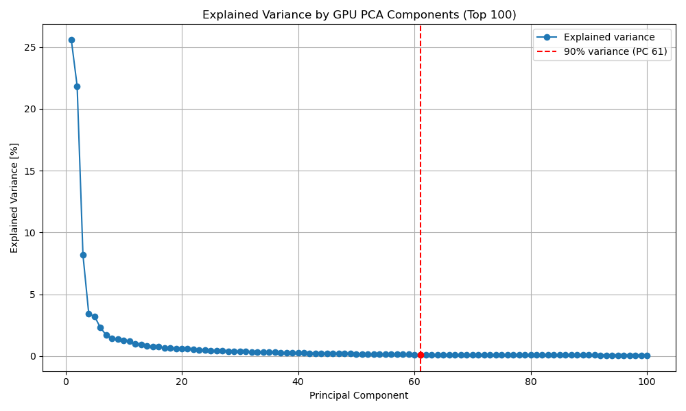
*File: [results/pca_gpu/normalized/explained_variance.png](results/pca_gpu/normalized/explained_variance.png)*

**t-SNE Embedding (CPU, Normalized Data)**

*File: [results/tsne_cpu/normalized/tsne_cpu_embedding.png](results/tsne_cpu/normalized/tsne_cpu_embedding.png)*

**UMAP Datashader Plot (GPU, Normalized Data)**
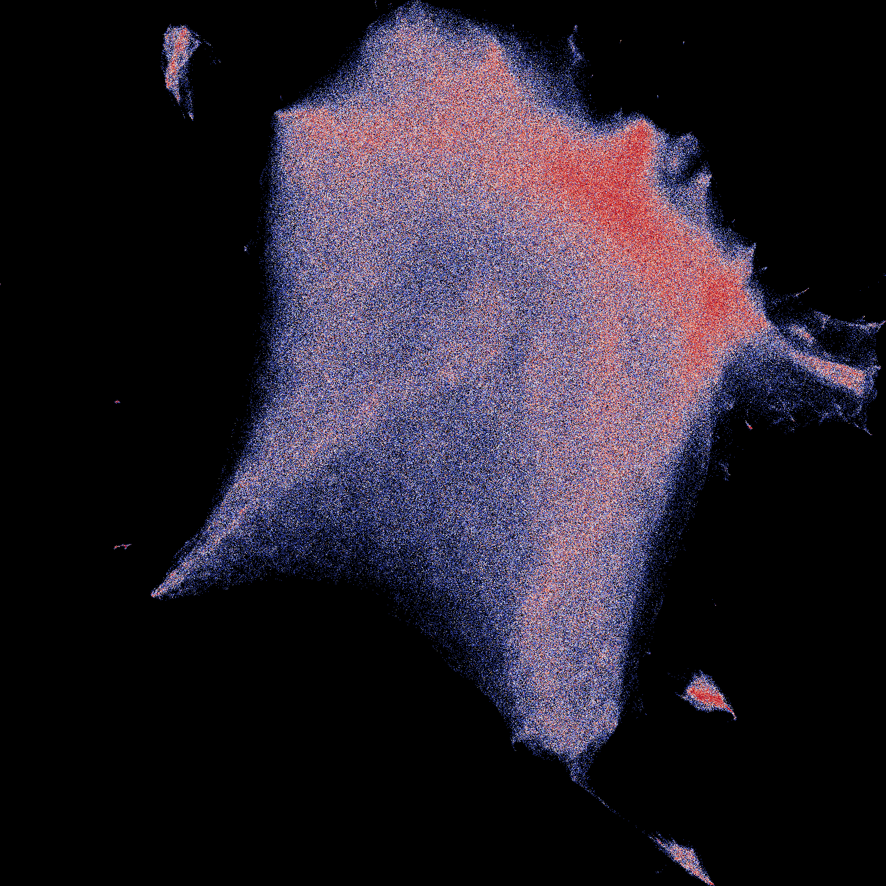
*File: [results/umap_gpu/normalized/umap_gpu_datashader_coolwarm_eqhist_black.png](results/umap_gpu/normalized/umap_gpu_datashader_coolwarm_eqhist_black.png)*

**PaCMAP Embedding (CPU, Normalized Data)**
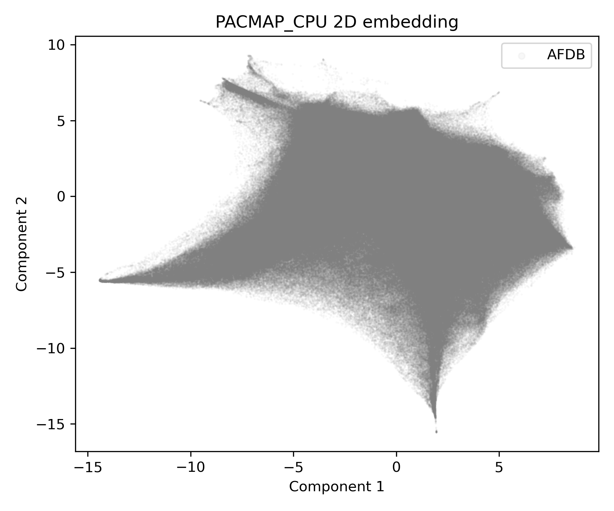
*File: [results/pacmap_cpu/normalized/pacmap_cpu_embedding.png](results/pacmap_cpu/normalized/pacmap_cpu_embedding.png)*

**PaCMAP Embedding (GPU, Normalized data) with different GPU run hyperparameters
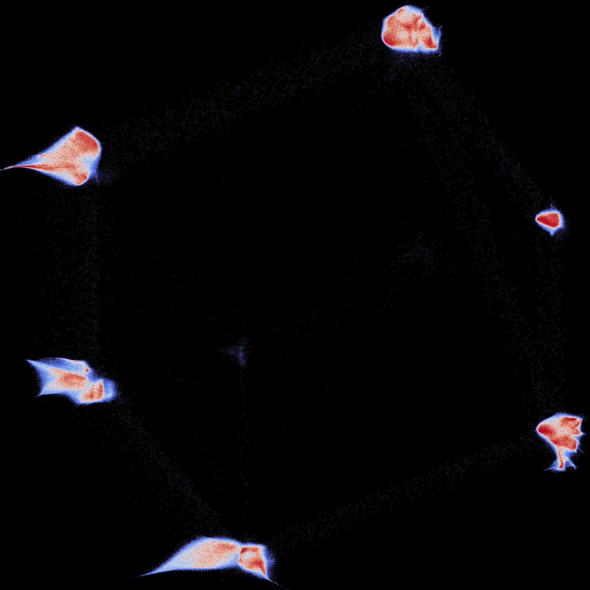

Timing and detailed metrics for each run are saved in `.txt` files within the respective `results/` subdirectories (e.g., [results/tsne_cpu/non_normalized/tsne_cpu_time.txt](results/tsne_cpu/non_normalized/tsne_cpu_time.txt)).

## Experiments analysis
Results analysis was perfomed in the `results_analysis/results_analysis.ipynb` jupter notebook, containing analysis of:
- time performance: wall time, CPU times,
- GPU used memory, times,
- comparisons across different run configurations (diffent methods, architectures, dataset normalization/non-normalization),
- illustrations of the abovementioned data.

#### Overall mean wall time comparison across different configurations (method, architecture, normalized/non-normalized dataset)
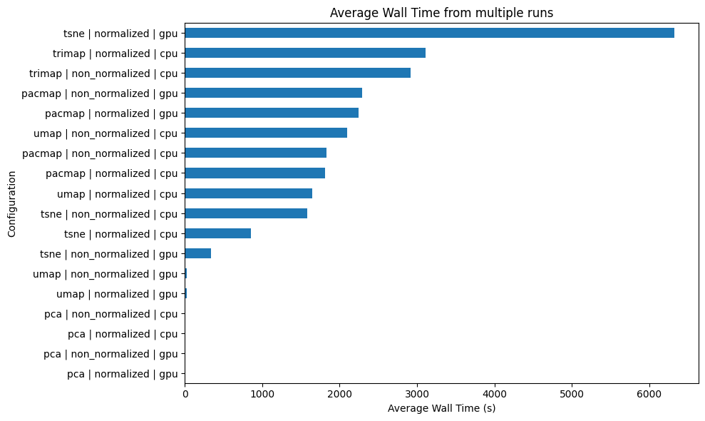

#### Methods performance with precomputed PCA embeddings
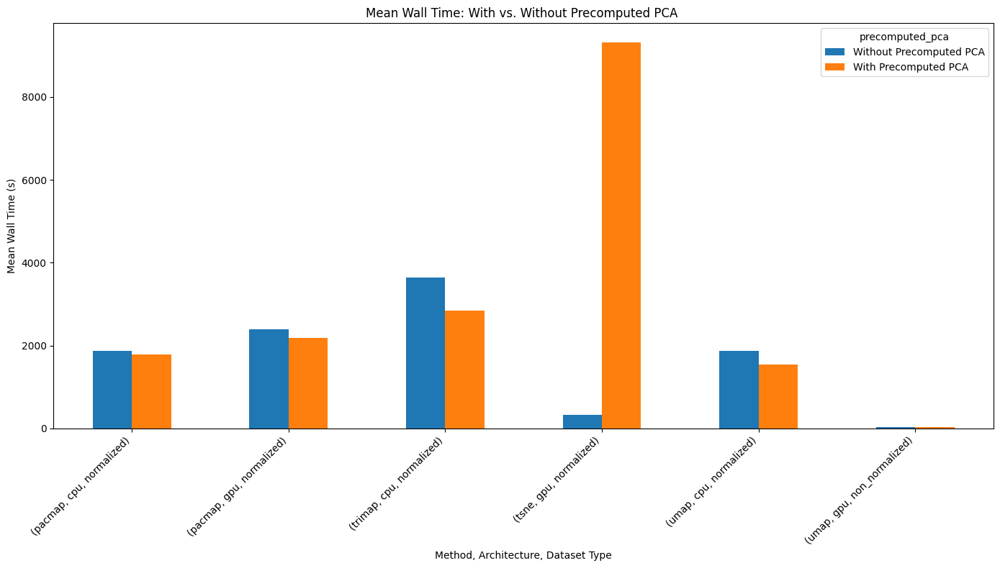
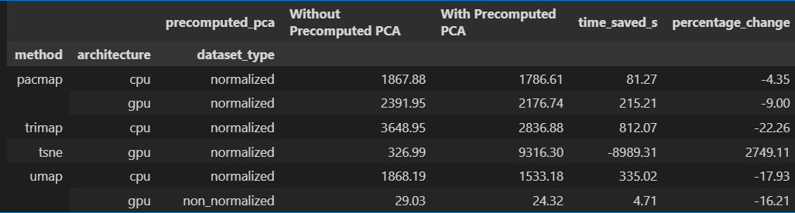

#### Wall time time distributions by methods and architectures (CPU vs. GPU)
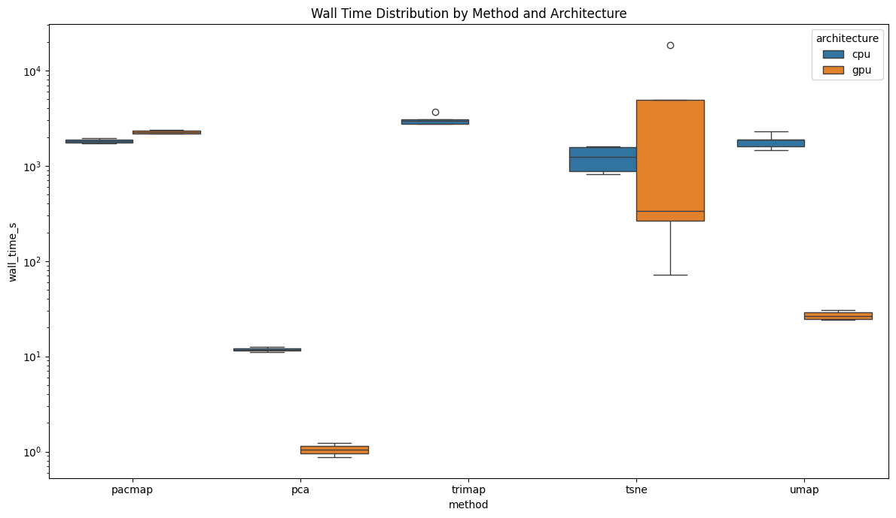
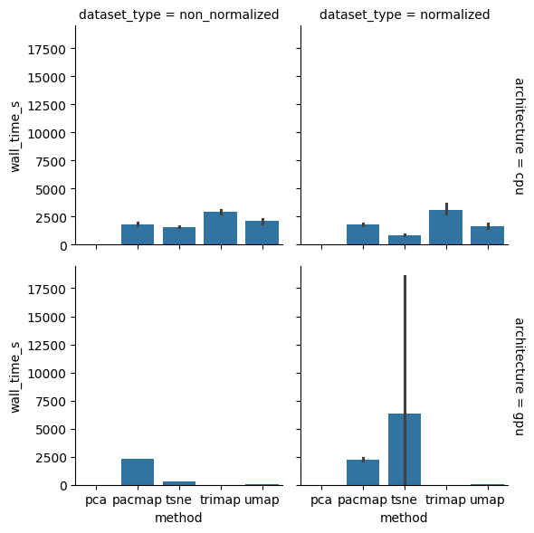

#### Structural analysis of the PCA-based experiments
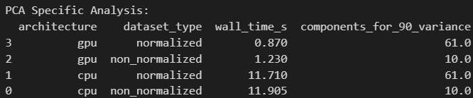
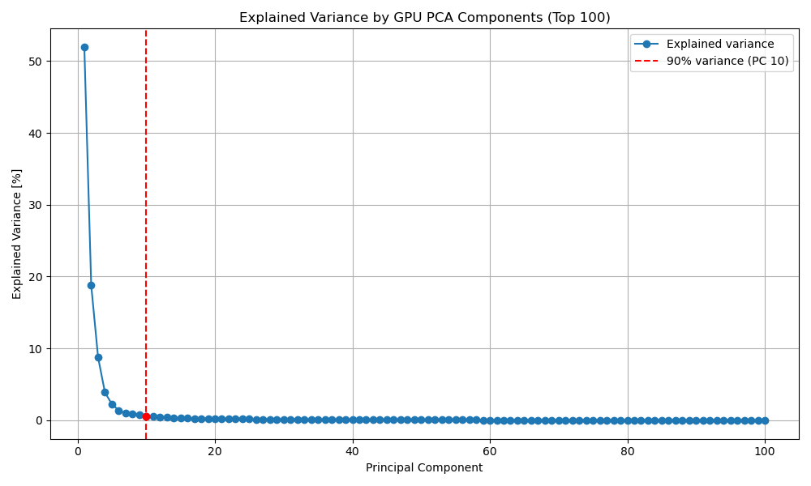

#### Methods time performance with reference to normalizing or non-normalizing the dataset

#### CPU/Wall mean times ratio
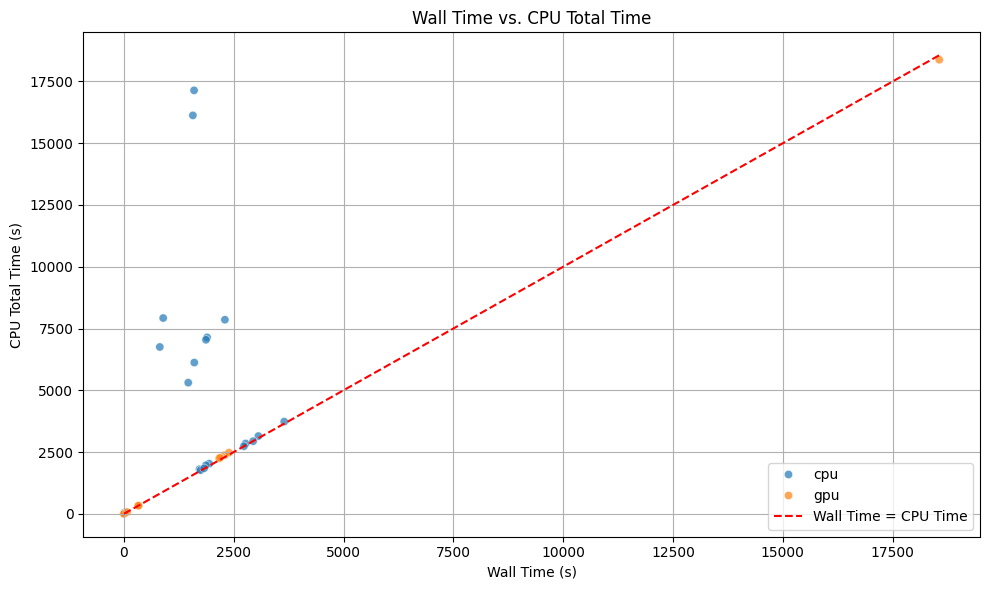

## We hope there's more to come
We hope to expand the experiments using other libraries or other methods. E.g. PCA on multiple nodes using Dask framework: 
https://ml.dask.org/modules/generated/dask_ml.decomposition.PCA.html.
As unforunately we've encountered trouble with Dask SLURMCluster scheduler: https://jobqueue.dask.org/en/latest/generated/dask_jobqueue.SLURMCluster.html.
